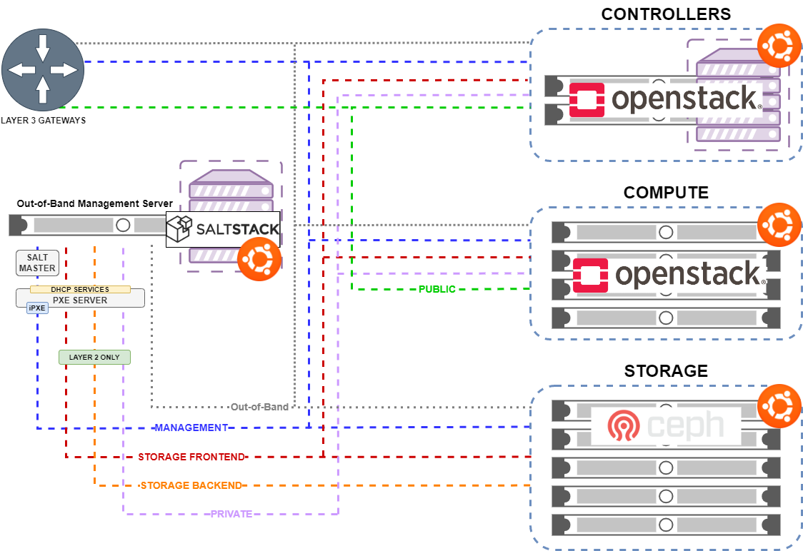

= kinetic

Kinetic is a deployment and maintenance tool for Cyber Ranges originally developed at the US Army Cyber School at Fort Gordon, Georgia.
A Cyber Range as envisioned by the https://www.gacybercenter.org/[Georgia Cyber Center] is a private cloud that brings significant capabilities to bear beyond clouds that are focused on enterprise information technology.
Instead of delivering enterprise IT services, a kinetic Cyber Range is focused on providing an environment to hack on, in, and with https://youtu.be/5Ofjr_-rsOg?t=1860[operational technology] (OT).
By delivering the ability to provide emulation and/or virtualization at scale for numerous microarchitectures *without needing to invest in any physical hardware beyond traditional amd64 servers*, kinetic lets OT security researchers focus on hacking rather than configuring individual instances of qemu and trying to figure out the correct magical configuration to get a given ISA to run.
Kinetic delivers the ability to rapidly scale-out OT-oriented workloads using cloud-native tooling and processes with minimal overhead.
The core components are https://www.saltstack.com/[salt], https://www.openstack.org[openstack], and https://ceph.com/[ceph].
It also integrates other projects such as https://www.graylog.org/[graylog], https://guacamole.apache.org/[guacamole], https://wiki.debian.org/AptCacherNg[apt-cacher-ng], and https://antora.org/[antora], with many more integrations to come.

Kinetic is currently in the middle of being converted from a bespoke, single environment solution to a framework - it is not ready for production and pointing your environment at our master branch will break everything.
The creation of the version 1.0 tag will indicate that kinetic is production ready.
We expect this to happen in January of 2021.

Kinetic is designed to make the deployment and maintenance of OT-focused cyber ranges easy and code-driven.
Every piece of the infrastructure is 100% reproducible and zero touch after your initial out-of-the-box hardware config (UEFI, etc.).
You set the configuration data for your local environment, start the salt orchestration runner, and you're done.

The various heat templates that power the scenarios that ship with kinetic all use a standard naming convention.
Sticking to this naming convention (instances, networks, images, etc.) mean that templates can be shared across organizations.

== Architecture



== Prerequisites

There are two critical repositories that are required for a successful kinetic deployment:

1. A repository containing the kinetic codebase that is used as a https://docs.saltstack.com/en/latest/topics/tutorials/gitfs.html[gitfs fileserver for salt] (usually just pointing at a branch/tag/sha on this github repository)
2. A repository containing your site-specific configuration information that is used as a https://docs.saltstack.com/en/latest/ref/pillar/all/salt.pillar.git_pillar.html#git-pillar-configuration[gitfs pillar for salt].
This can be stored anywhere.
Secrets should be encrypted using the salt pillar https://docs.saltstack.com/en/latest/ref/renderers/all/salt.renderers.gpg.html[gpg renderer]

Additionally, you need to ensure that:

1. All hosts (compute, controller, storage, container) have their firmware AND option ROMs in UEFI-only mode.
2. You have designed your subnetting scheme to support all required networks (public, private, management, storage frontend, storage backend, out-of-band)
  * controller - management, storage frontend, private, public
  * compute - management, storage frontend, private, public
  * storage - management, storage frontend, storage backend
  * container - management, storage frontend, private, public
3. You have a fresh installation of a https://get.saltstack.com/rs/304-PHQ-615/images/SaltStack-Supported-Operating-Systems.pdf[an operating system that has salt-master support] on a machine that has at least 8G of RAM.
This machine needs to have bridging configured already and https://docs.saltstack.com/en/latest/topics/tutorials/gitfs.html#installing-dependencies[gitfs dependencies] installed.
Pygit2 is preferred.
This is the host on which you will run `bootstrap.sh` and will run your salt master as well as your pxe server.
Both the salt master and pxe server will run in separate kvm virtual machines.
4. All hosts can reach your salt master on TCP 4505/4506 and TCP 8000.
TCP 8000 is required for salt-api.

NOTE: There is no need for the master to be able to reach any of its minions on any port or address.

5. Your dhcp server is issuing ipxe.efi as the efi 64 bit boot filename and next-server is set to pxe
6. DHCP clients can successfully register their leases in your local DNS resolver.

NOTE: If your dhcp server does not support issuing a hostname as next-server, you will need to create your own tftp server and have it issue a special ipxe chainload file.
Your system will automatically compile a fresh copy of this for you from source.
The freshly compiled version will be located at /var/www/html/ipxe/src/bin-x86_64-efi/ipxe.efi on your pxe server once it is fully highstated.
See formulas/pxe/files/kinetic.ipxe in this repository for the source.

== Recommendations

Kinetic is desiged to be used on larger environments that have multiples of the same type of hardware performing the same purpose,
e.g. your purchasing department bought 50 compute nodes, 50 storage nodes, and 6 controller nodes at the same time, so they all have the same configuration amongst themselves.
That's not to say that it *can't* be used with hardware that you find randomly and slap together, it will just require configuration additional hardware types in your environment files.

Kinetic is currently *not* designed to provide upgrade paths.
When new major releases come out upstream, you roll your entire infrastructure.
Kinetic events should typically be ephemeral and short lived, and the environment itself should be viewed as scratch space.
For example, of the terabytes of data that get generated during the fuzzing process, only a very small amount of it is useful.
This information should be extracted and stored on the enterprise storage system of your choice and protected appropriately.

While the cache is optional, it is *highly* recommended that you use it.
Large, simultaneous operations will almost certainly get you throttled upstream as you download and install packages.

== Quick Start

On your configured foundational host, run:
```
curl {{ bootstrap }} |
sudo bash -s -- -a {{ answers }}
```

where

`{{ bootstrap }}` = The raw URL to the bootstrap script that you intend to use for your deployment.
Take note of the tag/branch/sha that you intend on using as it *must* be compatible with the branch/tag/sha of your answers file.

`{{ answers }}` = The raw URL to the answers.sls file that you intend to use for your deployment.
This file should be of the same version tag as your kinetic deployment to ensure that you have all of the correct options.
E.g. if you are executing bootstrap.sh from the foo release of kinetic, your pillar repository should use the available
options from the foo release of kinetic-pillar.

Example:

```
curl https://raw.githubusercontent.com/georgiacyber/kinetic/master/bootstrap/bootstrap.sh |
sudo bash -s -- -a https://raw.githubusercontent.com/GeorgiaCyber/kinetic-pillar/master/environment/answers.sls
```

As the script completes, you should see a message stating that both pxe and salt have been created from their respective config.xml files by virsh.
You can track their bootstrap process with ```tail /kvm/vms/*/console.log```.
Once you see a message on both hosts that cloud-init has finished with the NoCloud datasource,
you can log in to both with the corresponding private key to the public key that was specified in your answers.sls file.

Log in to salt first:

`ssh root@salt`

NOTE: If your dhcp server does not support/allow dynamically registering hostnames in a corresponding DNS server, you will not be able to ssh to the `salt` hostname and pxe will not have yet registered with salt either.
You will need to create a static A record in your DNS server that lets both `salt` and `pxe` resolve to the correct respective addresses before continuing.
Once you complete this task and re-start the `salt-minion` service on the pxe server, you may continue with the below.

Once you're in the salt master, check for the presences of 2 as-yet unaccepted keys:

```
root@salt:~# salt-key
Accepted Keys:
Denied Keys:
Unaccepted Keys:
pxe
salt
Rejected Keys:
```

If you see both pxe and salt in the unaccepted list, the bootstrap was successful.  Go ahead and accept the keys:
```
salt-key -A
```

At this point you should be able to communicate with both of your minions via your salt master:
```
root@salt:~# salt \* test.ping
pxe:
    True
salt:
    True
```

The next thing you will want to do is highstate your salt master so it can be fully configured and ready to orchestrate the rest of your environment:

```
salt-call state.highstate
```

NOTE: You can safely ignore any deprecation warnings printed while this command executes.

Depending on the size of your specified networks and speed of your salt-master, this command can take several minutes to execute.
Here is an example output runtime, for reference:

```
Summary for local
--------------
Succeeded: 827 (changed=823)
Failed:      0
--------------
Total states run:     827
Total run time:   395.820 s
```

If you were to run an additional highstate, you would see that some of the states return as being already complete, and some do not.
This is because when you run the initial salt-master highstate, you are creating several secrets unique to your environment that will then be loaded in to the https://docs.saltstack.com/en/latest/topics/tutorials/pillar.html[pillar].
There are other states in your environment (such as the ones that create your bash and powershell authentication convenience files) that rely on these pillar values to execute successfully.
As the salt pillar cannot be refreshed during the middle of an individual salt state run, it is necessary to run a 2nd highstate on your salt master in order to fully prepare it for operation:

```
salt-call state.highstate
```

After this run, you will see a handful of changes in the return dictionary:

```
...
----------
          ID: /srv/dynamic_pillar/adminrc
    Function: file.managed
      Result: True
     Comment: File /srv/dynamic_pillar/adminrc updated
     Started: 16:38:45.877319
    Duration: 80.886 ms
     Changes:
              ----------
              diff:
                  ---
                  +++
                  @@ -1,6 +1,6 @@
                   #!/bin/bash
                   export OS_USERNAME=admin
                  -export OS_PASSWORD=TBD
                  +export OS_PASSWORD=random_string
                   export OS_USER_DOMAIN_NAME=Default
                   export OS_PROJECT_NAME=admin
                   export OS_PROJECT_DOMAIN_NAME=Default
----------
          ID: /srv/dynamic_pillar/adminrc.ps1
    Function: file.managed
      Result: True
     Comment: File /srv/dynamic_pillar/adminrc.ps1 updated
     Started: 16:38:45.958400
    Duration: 13.049 ms
     Changes:
              ----------
              diff:
                  ---
                  +++
                  @@ -1,5 +1,5 @@
                   $env:OS_USERNAME = "admin"
                  -$env:OS_PASSWORD = "TBD"
                  +$env:OS_PASSWORD = "random_string"
                   $env:OS_USER_DOMAIN_NAME = "Default"
                   $env:OS_PROJECT_NAME = "admin"
                   $env:OS_PROJECT_DOMAIN_NAME = "Default"
----------
          ID: /etc/salt/master
    Function: file.managed
      Result: True
     Comment: File /etc/salt/master is in the correct state
     Started: 16:38:45.971714
    Duration: 2.585 ms
     Changes:
----------
          ID: salt-api_service
    Function: service.running
        Name: salt-api
      Result: True
     Comment: The service salt-api is already running
     Started: 16:38:45.987873
    Duration: 24.491 ms
     Changes:
----------
          ID: salt-master_watch
    Function: cmd.run
        Name: salt-call service.restart salt-master
      Result: True
     Comment: State was not run because none of the onchanges reqs changed
     Started: 16:38:46.019181
    Duration: 0.003 ms
     Changes:

Summary for local
--------------
Succeeded: 825 (changed=3)
Failed:      0
--------------
Total states run:     825
Total run time:     9.068 s
```

At this point, your master is fully configured with your unique environmental information.
The next step is to properly encrypt your bmc password so it can be safely stored on a publicly available repository.
On your salt master, run:

```
echo -n mypass | gpg --homedir /etc/salt/gpgkeys/ --encrypt --armor --recipient kinetic@georgiacyber | sed 's/^/  /g'
```

Where 'mypass' is your specific bmc password.
This will encrypt your bmc password using your unique pki setup that was generated when you ran your initial bootstrap script.
To see the default parameters for this setup, see bootstrap/resources/key-generation.
This command will return something similar to the below:

```
  -----BEGIN PGP MESSAGE-----

  hF4DyVz5FsHlPcwSAQdAsheDK25osLvF9modvTbEbIyDLeikcxfgs/J90au4KS8w
  okyQP6B39GGUv2msgPTDjgQd4RjEuEoLV6BVxkd55VtGjNk/SoeGYsdaDTUOieTX
  0kEBhyT7twmzjTt273mQL3hiXIT/WS/FUZ0xLthaWESt9UJ/ufgSzJFXhLoSe+Vl
  FHNzdk9d+Au14EQpQ6qlKKa7Gg==
  =oSuH
  -----END PGP MESSAGE-----
```

Take this string and place it in your pillar in the environment/bmc_password.sls file like so:

```
#!yaml|gpg

bmc_password: |
  -----BEGIN PGP MESSAGE-----

  hF4DyVz5FsHlPcwSAQdAsheDK25osLvF9modvTbEbIyDLeikcxfgs/J90au4KS8w
  okyQP6B39GGUv2msgPTDjgQd4RjEuEoLV6BVxkd55VtGjNk/SoeGYsdaDTUOieTX
  0kEBhyT7twmzjTt273mQL3hiXIT/WS/FUZ0xLthaWESt9UJ/ufgSzJFXhLoSe+Vl
  FHNzdk9d+Au14EQpQ6qlKKa7Gg==
  =oSuH
  -----END PGP MESSAGE-----
```

Once you push this change to your pillar gitfs repository, run the following on your salt-master:

```
salt-call saltutil.refresh_pillar
```

This will tell the salt-master to forcefully pull new pillar data and re-render all of its information.
At this point, if you call for your bmc_password pillar item, you will get your actual password displayed:

```
root@salt:~# salt-call pillar.item bmc_password
salt:
    ----------
    bmc_password:
        mypass
```

If you don't get the plaintext version of your password, wait about a minute and then try `salt-call saltutil.refresh_pillar` and `salt-call pillar.item bmc_password` commands again.
There is a refresh interval that you can miss on occasion if your changes are very fresh.

At this point, you can run a highstate job on your pxe machine:

```
salt pxe state.highstate
```

NOTE: `salt-call` is not usable/applicable here because you are running a command on a remote minion, rather than the salt-master itself.
You must use the `salt` command.

Once again, this command will take several minutes to execute as it includes a few compilation tasks:

```
...
----------
          ID: apache2_service
    Function: service.running
        Name: apache2
      Result: True
     Comment: Service restarted
     Started: 20:56:32.788566
    Duration: 130.199 ms
     Changes:
              ----------
              apache2:
                  True
----------
          ID: salt-minion_mine_watch
    Function: cmd.run
        Name: salt-call service.restart salt-minion
      Result: True
     Comment: Command "salt-call service.restart salt-minion" run
     Started: 20:56:32.920253
    Duration: 10.932 ms
     Changes:
              ----------
              pid:
                  16536
              retcode:
                  None
              stderr:
              stdout:

Summary for pxe
-------------
Succeeded: 33 (changed=29)
Failed:     0
-------------
Total states run:     33
Total run time:  405.475 s
```

As part of your pxe minions highstate process, it ran the custom ```redfish.gather_endpoints``` function, which scraped your out-of-band network specificed in your pillar for active BMCs.
It cataloged and stored all detected BMCs in a special place called the salt mine so your kinetic deployment is always aware of the various types of physical hardware it needs to interface with.

You can view the current BMC mine data by running:

```
salt-run mine.get pxe redfish.gather_endpoints
```

Which will return data that looks like this:

```
    00000000-0000-0000-0000-AC1F6BB6DF49:
        10.100.0.33
    00000000-0000-0000-0000-AC1F6BB6DF4E:
        10.100.0.35
    00000000-0000-0000-0000-AC1F6BB6DF4F:
        10.100.0.32
```

The pairing of the SMBIOS UUID to the BMC IP address allows your kinetic deployment to easily identify and managed your hardware.
At this point, your two foundational minions are fully configured and you are ready to being your kinetic deployment.
To create your controllers, run:

```
salt-run state.orch orch | tee $(date "+%F-%T").log
```

This will kick off the full provisioning routine.
If you have enabled TNSR support in your pillar (and have TNSR appropriately configured), no further action is required and once this routine completes, you will have a functional environment.
If not, you must manually update your gateway with the proper port-forwarding information once your haproxy endpoint gets issued its address.
