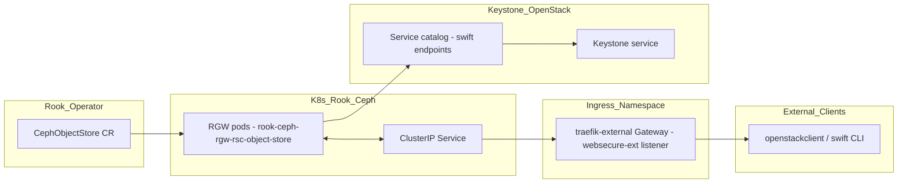

# Swift/Rook Gateway Formula

How `formulas/swift/configure.sls` deploys Ceph RGW (Swift/S3) using Rook's
`CephObjectStore` CRD, exposes it externally via Gateway HTTPRoute, and
registers it in the Keystone service catalog.

## The short version

- Rook manages the Ceph RGW gateway as a `CephObjectStore` custom resource
  (not a bare-metal `radosgw` daemon).
- The formula creates the `keystone-admin` secret containing OpenStack
  `OS_*` credentials so RGW can authenticate itself to Keystone (this is
  **RGW acting as a client to Keystone**, not end-user auth).
- It registers `swift` as an `object-store` service in Keystone with three
  endpoints (admin/internal/public) and wires the public one through an
  external Gateway HTTPRoute.
- Configuration like `enable_apis`, extra `rgwConfig` keys, and
  `rgwCommandFlags` are passed through the Rook CR so you don't have to
  edit `ceph.conf` by hand.



## Components

### 1. `keystone_admin_secret`

Creates a Kubernetes Secret named `keystone-admin` in the `rook-ceph`
namespace containing a full `openrc`-style set of `OS_*` environment
variables (`OS_AUTH_TYPE`, `OS_USERNAME`, `OS_PASSWORD`, `OS_PROJECT_NAME`,
etc.).

**Why this exists**: Rook's `CephObjectStore` with `auth_keystone: true`
tells the RGW gateway to use Keystone for authentication/authorization.
RGW (running inside the Rook-managed pods) needs to be able to *call
Keystone* to validate tokens and map users to projects. It expects these
credentials in a specific format (the same keys you would find in an
`openrc` file), not just a raw username/password pair.

This is **not** the same as the end-user Swift credentials. This is the
service account RGW itself uses to talk to Keystone.

### 2. `deploy_ceph_object_store`

The heart of the formula. It creates a `rook.ceph_object_store_present`
state that manages a `CephObjectStore` CR named `rsc-object-store`.

Key settings passed through:
- `enable_apis: [s3, swift]` — which frontends RGW actually listens on.
- `rgw_config` — extra `ceph.conf` `[client.rgw.*]` keys (timeouts, thread
  pool size, max object sizes, etc.).
- `rgw_command_flags` — command-line flags passed to the `radosgw`
  process itself (e.g. overriding the Beast frontend timeout).
- `auth_keystone` + related Keystone settings — tells RGW to use the
  `keystone-admin` secret above for Keystone integration.
- `gateway_resources` — CPU/memory requests/limits for the RGW pods.

### 3. Keystone catalog integration (`swift_service`, `swift_region`, `swift_endpoint_*`)

Registers `swift` as an `object-store` service type in Keystone and creates
three endpoints:

- **admin** and **internal**: point at the in-cluster Kubernetes Service
  (`rook-ceph-rgw-rsc-object-store.rook-ceph.svc.cluster.local`). These
  are used by other OpenStack services or internal tooling.
- **public**: points at the external hostname
  (`https://<swift_public_hostname>/swift/v1/AUTH_$(tenant_id)s`) and
  requires the HTTPRoute to exist first.

Note the URL template uses `$(tenant_id)s` (not the older
`%(tenant_id)s`). This is the syntax Swift/RGW expects when using
Keystone's implicit tenant mapping.

### 4. `swift_httproute`

Creates a `k8s.httproute_present` that routes external traffic for the
Swift/S3 hostnames through the `traefik-external` Gateway
(`websecure-ext` listener) directly to the RGW Service on port 80.

TLS termination happens at the Gateway (certificate managed elsewhere),
so the HTTPRoute itself is plain HTTP to the backend.

## Configuration knobs

| Key | Where it ends up | Purpose |
|-----|------------------|---------|
| `enable_apis` | `spec.protocols.enableAPIs` on the CephObjectStore | Which RGW frontends to actually start (s3, swift, swift_auth, admin, etc.) |
| `rgw_config` | `spec.gateway.rgwConfig` | Arbitrary `ceph.conf` settings for the RGW daemon |
| `rgw_command_flags` | `spec.gateway.rgwCommandFlags` | Extra CLI flags passed to the radosgw binary |
| `auth_keystone` + `keystone_*` | `spec.auth.keystone` + `spec.gateway.rgwConfig` | Enables Keystone integration and configures how RGW talks to it |
| `swift_account_in_url` | `spec.protocols.swift.accountInUrl` | Whether Swift URLs include the account (project) segment |

## CRD recreation / finalizer workaround

When `preserve_pools_on_delete: true` (the default when you want to keep
Ceph data), the `CephObjectStore` finalizer blocks actual deletion until
Rook cleans up the pools. In practice the state reports "deletion
initiated" but the CR stays `Terminating` indefinitely.

**Manual workaround** (documented here until the state can prompt it
automatically):

1. The failing orchestration run deletes the CR and exits.
2. On the Kubernetes cluster, remove the finalizer:
   ```bash
   kubectl -n rook-ceph patch cephobjectstore <name> \
     --type json -p '[{"op":"remove","path":"/metadata/finalizers"}]'
   ```
3. Re-run the orchestration. The next run will see the 404 and create a
   fresh `CephObjectStore` with the updated spec while the underlying
   Ceph pools (and therefore the data) remain intact.

## Relationship to other components

- **Glance** (when using Swift backend) will use the Keystone-registered
  Swift endpoints and typically authenticates as a user in the `service`
  project. The `keystone_admin_secret` here is **not** for Glance — it's
  only for RGW itself.
- The HTTPRoute assumes an external Gateway (`traefik-external`) already
  exists with a `websecure-ext` listener that has a TLS certificate
  attached. The actual certificate is managed outside this formula.
- If you also need RGW users/subusers created declaratively, see
  `kinetic-rook.ceph_object_store_user_present` and
  `kinetic_rook.rgw_subuser_present` (the latter requires the Ceph Mgr
  Dashboard to be linked to RGW first).

## Notes / gotchas

- The `keystone-admin` secret must be present **before** the
  `CephObjectStore` is created when `auth_keystone: true` is set,
  otherwise Rook/RGW may fail to start or may not be able to validate
  tokens.
- Changing `enable_apis`, many `rgw_config` keys, or `rgw_command_flags`
  will cause the state to delete and recreate the `CephObjectStore`
  (Rook treats these as creation-time only in many cases). Watch the CR
  during such changes.
- The three Keystone endpoints are intentionally different: admin/internal
  stay inside the cluster for service-to-service traffic; public goes
  through the external Gateway for end users and CLI tools.

Last updated: September 2026
```