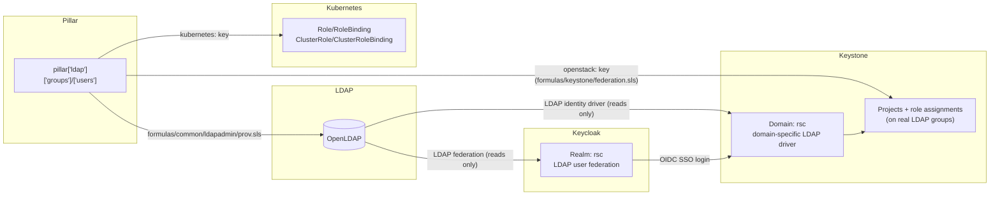

# LDAP, Keycloak, and Keystone Identity Federation

How LDAP, Keycloak, and OpenStack Keystone fit together in this repo, and the
one pillar tree (`pillar['ldap']`) that drives all three - so that adding
someone to a group is a single edit, not three.

## The short version

- **LDAP is the single source of truth** for users and groups (`ldap:users`,
  `ldap:groups` in pillar).
- **Keycloak** authenticates humans (SSO/OIDC) against that same LDAP
  directory via its LDAP user federation - it does not own its own copy of
  user/group data.
- **Keystone** (OpenStack's identity service) has a domain (`rsc` by default)
  configured with a domain-specific **LDAP identity driver**, pointed at the
  same LDAP tree. Keystone project/role assignments are made against the
  **real LDAP groups** in that domain.
- When someone logs into Keystone via Keycloak SSO, Keystone maps the login
  directly onto that person's **already-existing real LDAP user account**
  (see "Why `type: local`?" below) - so their OpenStack permissions come from
  the exact same LDAP group membership as if they'd authenticated with a
  password directly against LDAP.



Two separate Salt files consume the same `pillar['ldap']['groups']` /
`pillar['ldap']['users']` lists:

| File | Manages | Runs against |
|---|---|---|
| `formulas/common/ldapadmin/prov.sls` | LDAP users/groups themselves, plus Kubernetes RBAC (`kubernetes:` key) | Applied via a standalone orchestration (`orch/k8s-ldap-prov.sls`) - **does not** require Keystone to be up. |
| `formulas/keystone/federation.sls` | Keycloak identity provider/protocol/mapping in Keystone, plus OpenStack projects and role assignments on the real LDAP groups (`openstack:` key) | Gated on Keystone actually being reachable (`keystone_available` health-check state) before doing anything. |

They're kept separate specifically because `prov.sls` needs to work even
when OpenStack/Keystone isn't up yet (e.g. on a fresh cluster), while
`federation.sls`'s OpenStack API calls would just fail if run too early. See
[Applying a change](#applying-a-change) below for how to run both together
in one command.

## Pillar shape

Both files read from the same list-based pillar (this is also documented,
for the Kubernetes-RBAC half specifically, in
[`kinetic-k8s.md`](kinetic-k8s.md)):

```yaml
ldap:
  users:
    - uid: mdanielson
      cn: "Mark Danielson"
      sn: Danielson
      pass: "..."              # optional, GPG-encrypted in practice
      kubernetes: {...}        # optional - see kinetic-k8s.md

  groups:
    - cn: ncu
      members:
        - mdanielson           # uids of users defined above (or bare DNs)
      member_groups:
        - admins                # cns of other groups defined here (nested membership)
      kubernetes:               # optional - see kinetic-k8s.md
        roles:
          - namespace: default
            role: view
      openstack:                # optional - see below
        projects:
          - name: ncu            # optional; defaults to this group's cn verbatim
            description: "..."   # optional; defaults to "Project for <name>"
            domain: Default      # optional; defaults to Default
            roles: [member]      # optional; defaults to [member]
```

### The `openstack:` key

Added per-group, drives `formulas/keystone/federation.sls`:

- `projects` may be a single mapping (shorthand for one project) **or** a
  list of mappings - both of these are equivalent:

  ```yaml
  openstack:
    projects:
      roles: [member]
  ```

  ```yaml
  openstack:
    projects:
      - roles: [member]
  ```

- `name` defaults to the group's `cn` **verbatim** (no character
  substitution) if omitted - this matters when the *same* project is
  referenced from more than one group (see the `admins` example below):
  whatever string you use for `name` must match exactly across every group
  that references that project, or you'll end up creating two different
  projects by mistake (this happened once with `gcr-persistent` vs a
  typo'd `gcr-presistent` in the `admins` group's list - worth
  double-checking project names any time you copy/paste a project list).
- `roles` (or singular `role`) is the list of Keystone role names to assign
  **this group** on the project. Defaults to `[member]`.
- Never creates OpenStack users, and never creates the LDAP groups
  themselves - `federation.sls` only creates/updates **projects** and
  **role assignments** on top of groups that `prov.sls` already provisions.

A single group can list many projects (typically your "admins" group,
granted `admin` on everything), and many groups can each grant themselves
`member` on their own like-named project - both patterns are deduplicated
correctly even when the same project name is referenced from multiple
groups (see `projects_map` in `federation.sls` if you're curious how).

```yaml
ldap:
  groups:
    - cn: admins
      members: [mdanielson]
      openstack:
        projects:
          - name: ncu
            roles: [admin]
          - name: gaaims
            roles: [admin]

    - cn: ncu
      members: []
      member_groups: [admins]
      openstack:
        projects:
          roles: [member]        # project name defaults to "ncu"
```

## Worked example: adding a member to a group

Using the group from the prompt:

```yaml
ldap:
  groups:
    - cn: ncu
      members:
        - mdanielson
      member_groups:
        - admins
      kubernetes:
        roles:
          - namespace: default
            role: view
```

Say you want to add a second person, `bcaldwell`, to the `ncu` group. Edit
the pillar:

```yaml
ldap:
  groups:
    - cn: ncu
      members:
        - mdanielson
        - bcaldwell            # <-- added
      member_groups:
        - admins
      kubernetes:
        roles:
          - namespace: default
            role: view
```

That's the only edit needed. What happens when this gets applied (see
[Applying a change](#applying-a-change)):

1. **LDAP** (`prov.sls`): `ldap_group_ncu` updates the `groupOfNames`
   `member` attribute in LDAP to include `bcaldwell`'s DN.
2. **Kubernetes RBAC** (`prov.sls`, same run): unaffected by this particular
   edit - the `kubernetes:` key here binds the `view` Role in `default` to
   the **group** `ncu` (not to individual members), so nothing needs to
   change on the Kubernetes side when membership changes; `bcaldwell`
   inherits access as soon as their Keycloak/OIDC token carries the `ncu`
   group claim.
3. **Keystone** (`federation.sls`): this particular `ncu` group entry has no
   `openstack:` key, so there is nothing for `federation.sls` to do for
   `ncu` directly. `bcaldwell` still gets OpenStack access indirectly
   through `member_groups: [admins]` - since `admins` already has an
   `openstack:` key with project role assignments, and `bcaldwell` is (or
   isn't, depending on your actual `admins` membership) a member of
   `admins` - the OpenStack-side effect always comes from a group's own
   (or nested, via `member_groups`) `openstack:` key, evaluated
   independently per group.

If instead you wanted `bcaldwell` (or the whole `ncu` group) to also get
OpenStack access to a project, you'd add an `openstack:` key to the `ncu`
group entry itself - see [The `openstack:` key](#the-openstack-key) above.

## Applying a change

Run the combined orchestration, which provisions LDAP/Kubernetes RBAC first,
then syncs Keystone projects/role assignments:

```bash
salt-run state.orchestrate orch.k8s-auth-sync pillar='{"k8s": "master-rsc-0"}'
```

(Replace `master-rsc-0` with whatever your `k8s` pillar value resolves to.)

This is intentionally **one command** - you never need to separately run
the `ldapadmin` and `keystone` formulas by hand for a simple membership
change. See `orch/k8s-auth-sync.sls`.

The name is deliberately generic (not `ldap-keystone-sync`) - LDAP should
stay the single source of truth for authorization wherever possible, and
this is the one place additional services get wired in if/when they need to
sync against that same `pillar['ldap']` data in the future.

If you only changed Kubernetes RBAC or LDAP data (no `openstack:` keys
touched), the Keystone step is still safe to run - it's fully idempotent
and will simply report no changes for anything that didn't move.

## Why `type: local` for the Keycloak/Keystone mapping?

`formulas/keystone/federation.sls` registers Keycloak as an identity
provider (`keystone_keycloak_idp`) and a federation mapping
(`keystone_keycloak_mapping`) in Keystone, so that OIDC logins from Keycloak
are accepted at all. The mapping rule looks like this:

```yaml
local:
  - user:
      type: local
      name: "{0}"
      domain:
        name: rsc
remote:
  - type: OIDC-preferred_username
```

`type: local` tells Keystone: *"don't create a separate ephemeral/shadow
identity for this login - resolve it directly onto an already-existing
Keystone user, matched by name + domain."* Since every Keycloak user here
is backed by (and named identically to) a real LDAP user already present in
the `rsc` domain, this means:

- No duplicate/shadow user is created for federated logins.
- Authorization comes from that **real** user's **real** LDAP group
  memberships and role assignments - the same ones a direct LDAP-password
  login would use. There is no separate "federated groups" concept to keep
  in sync.
- Keystone's `OIDC-preferred_username` claim (not the more common
  `HTTP_OIDC_PREFERRED_USERNAME` env var) is used deliberately - Apache's
  `mod_wsgi` drops the `HTTP_OIDC_PREFERRED_USERNAME` header before it
  reaches Keystone in this deployment, but the raw `OIDC-preferred_username`
  header is still readable directly.

### The road not taken: ephemeral/shadow federation + `HTTP_OIDC_GROUPS`

An earlier version of this mapping used Keystone's normal *ephemeral
federated user* flow instead - mapping the Keycloak `groups` claim
(`HTTP_OIDC_GROUPS`) onto Keystone groups via a `groups: "{1}"` local rule,
and creating a shadow/ephemeral user per login. This turned out to be
incompatible with domain-specific LDAP-backed groups: Keystone's federated
shadow-user group-membership tracking
(`ExpiringUserGroupMembership`) unconditionally writes a row with a foreign
key into the SQL `group` table for every resolved group id, on every
federated login - which fails with a `DB IntegrityError` for groups that
live in an LDAP-backed domain (they have no corresponding row in the SQL
`group` table).

`type: local` sidesteps this class of bug entirely, since that code path
only runs for ephemeral users. It's also simpler: one less layer of
group-claim mapping to keep in sync with the real LDAP groups.

## Troubleshooting

- **"Group `['groupA', 'groupB']` has no entry in the backend" /
  malformed LDAP filter containing a Python list repr** - this was a
  symptom of the old ephemeral/`HTTP_OIDC_GROUPS` approach (see above) and
  should not occur with the current `type: local` mapping, since group
  claims are no longer parsed at all. If you see it again, check whether
  `mapping_rules` has been pillar-overridden back to a `groups:`-based rule.
- **User gets a valid Keycloak login but no OpenStack permissions** - check
  that the Keycloak username (the `preferred_username` claim) exactly
  matches the real LDAP `uid`/`cn` used to create that user in `rsc` via
  `prov.sls`. `type: local` requires an exact match; there's no fallback
  identity creation.
- **Two projects appear where you expected one** - almost always a
  copy/paste typo in a project `name:` across two different groups (see the
  `gcr-persistent`/`gcr-presistent` note above). `federation.sls` matches
  projects by exact string equality of `name`.
- **"found conflicting ID" when rendering `federation.sls`** - would mean
  two groups resolved to the same Salt state ID but with *different*
  literal project names or role sets in a way the dedup logic didn't
  expect; in practice this is now handled automatically (see `projects_map`
  in `federation.sls`), but if it recurs, check for inconsistent casing or
  whitespace in a `name:` field.
- Changed `ldap:groups`/`ldap:users` but nothing happened? Make sure you
  ran the orchestration (`orch/k8s-auth-sync.sls`), not just a
  `state.apply` of one formula - see
  [Applying a change](#applying-a-change).

Last updated: August 2026
