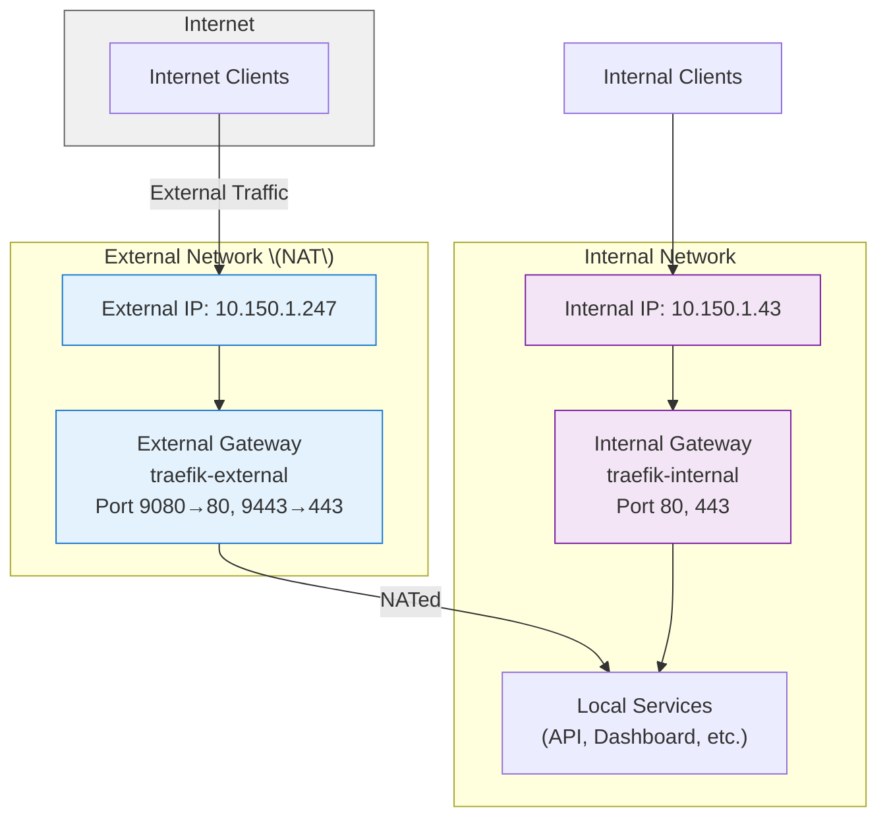

# k8s-ingress-controller Formula

Deploys Traefik as a dual (internal + external) ingress controller using Gateway API and MetalLB, with HTTPRoute-based certificate management.

## Purpose

This formula sets up a complete ingress solution with:
- MetalLB for LoadBalancer IP management (internal: 10.150.1.43, external: 10.150.1.247)
- Two Traefik instances with Gateway API
- Automatic TLS certificates via HTTP-01 challenges (using HTTPRoute)

## Network Flow



**Key Points:**
- **Internal Gateway**: Direct access within local networks only
- **External Gateway**: Traffic is NAT'd from the external IP to reach internal services
- Both gateways use the same backend services but through different entry points

## Refactored Certificate Management

Certificates are now managed via the new `res-k8s:certs` pillar structure with separate `external` and `internal` configurations.

**Important**: For external certificates, use `letsencrypt-staging` during testing to avoid rate limiting. Switch to `letsencrypt-prod` for production.

## Pillar Structure Summary

**Key sections to configure:**

- `res-k8s:lbs:ingress` - Traefik Helm values (ports, providers, securityContext)
- `res-k8s:certs` - Certificate configuration with `external` and `internal` sections
  - `name`, `issuer`, `commonname`, `dns_names`
  - External uses Let's Encrypt (`letsencrypt-prod` or `letsencrypt-staging`), internal uses your CA (`cyberrange-ca-issuer`)
- `metallb_namespace`, `traefik_external_namespace` - namespace settings

See the attached pillar example for the complete structure.

## Key Components Installed

1. **MetalLB** with two IP pools and L2 advertisements
2. **Traefik** (two Helm releases: internal + external)
3. **Certificates** via `k8s.certmanager_certificate_present` with HTTPRoute
4. **Gateway API** resources (`Gateway` with HTTP/HTTPS listeners)

## Usage

```yaml
include:
  - /formulas/common/k8s-ingress-controller
```

## Dependencies

- `formulas/common/helm` (via `k8s_helm` states)
- `formulas/common/k8s` (namespace, metallb, gateway, certmanager states)
- cert-manager with issuers: `letsencrypt-prod`/`letsencrypt-staging` and `cyberrange-ca-issuer`
- Pre-existing `GatewayClass` named `traefik`

## Notes

- **HTTPRoute-based certificates** replace the previous approach
- Use staging issuer for external certs during development to avoid rate limits
- Two separate Traefik releases to support different external IPs

## Files

- `init.sls` — Main entrypoint
- `install.sls` — Helm releases, certificates (via HTTPRoute), and Gateway resources
- `configure.sls` — MetalLB configuration
- `README.md` — This file

**Last updated**: July 2025
